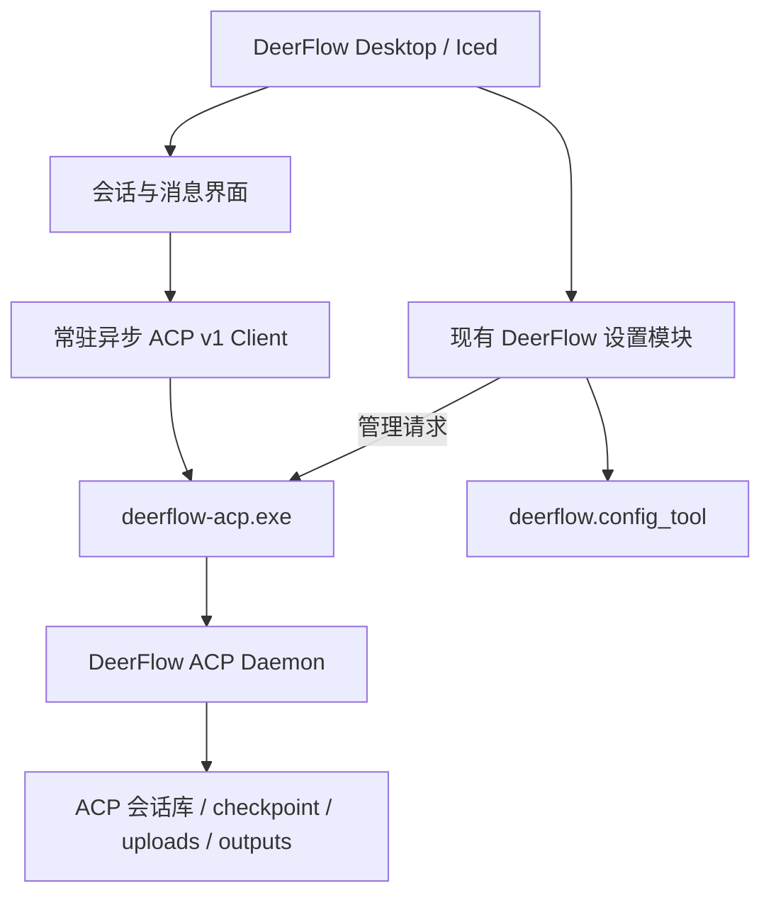

# DeerFlow ACP Portable 增加 Desktop 的可行性分析

日期：2026-09-17。范围：当前仓库与 `D:\Tools\waku` 的源码、构建脚本和文档静态分析；未改动产品实现，未启动服务或调用真实模型。

补充评估：用户随后明确提出直接复用 Waku 源码。进一步检查发现本地 Waku 已内置 DeerFlow Provider。若优先获得 Waku 的完整会话体验，推荐优先采用 [Waku fork 路线](desktop-waku-fork-feasibility-20260917.md)。下文保留为延续 Iced 配置工具、独立构建会话界面的备选方案。

## 结论

可行，推荐继续使用当前 Rust/Iced 桌面技术栈，把产品扩展为内置会话工作台。会话的信息组织与操作参考 Waku；设置页复用 DeerFlow ACP 当前页面、配置服务和保存应用流程。

现有后端已经覆盖普通桌面对话所需的大部分执行能力。主要工作是补齐会话客户端、消息渲染、桌面状态和生命周期规则，而不是另建一套 Agent 运行时。完整复刻 Waku 的 Git、终端、浏览器、多 provider 和断线运行能力则是明显更大的范围。

## 已有基础与复用边界

| 范围 | 已有实现 | Desktop 改造 |
| --- | --- | --- |
| Windows 便携交付 | Rust ACP Bridge、Iced 配置工具、内嵌 Python、相对布局的 user-data | 增加 Desktop 入口，延续打包与数据目录 |
| 全局配置 | 模型、Agent、记忆、Skills、自进化、工具权限、ACP 参数、诊断、数据恢复 | 抽取为可嵌入的设置模块 |
| 配置安全与一致性 | config_tool 的验证、密钥脱敏、版本冲突检查、备份、原子写入 | 继续调用同一服务，避免桌面另写 YAML |
| 会话执行 | ACP 新建、分页列表、加载历史、流式更新、取消、权限请求 | 新增常驻异步 ACP client 与界面状态机 |
| 会话配置 | 模型、思考、Agent profile、审批方式、Subagent、default/plan | 放在聊天输入区附近；与全局默认设置区分 |
| 持久化 | ACP 会话 SQLite 与独立 checkpoint；uploads/outputs | 保持后端为执行历史的权威来源，新增桌面展示状态 |
| 内容呈现 | ACP 已有文本、工具、计划、产物及图片相关能力 | 新增 Markdown、工具卡片、审批卡片、附件与产物视图 |

证据：`desktop/Cargo.toml:14`、`desktop/src/main.rs:78`、`desktop/src/main.rs:877`、`deerflow/config_tool.py:766`、`deerflow/acp/agent.py:136`、`deerflow/acp/agent.py:217`、`scripts/build-deerflow-portable.ps1:52`。

## 推荐架构

首版优先 ACP v1。它的新建和加载响应提供 `config_options`；当前 v2 facade 未完整转出这些设置，也没有等价完整的配置切换入口。模型切换应使用已实现的 `set_config_option`，不能假设 `session/set_model` 可用。

桌面可在一条长期连接上管理多个会话；后端按 session ID 路由与隔离。同一会话只允许一个连接持有，并且只允许一个并发操作。外部 ACP 客户端仍可复用同一个 daemon，但不能同时接管桌面已附着的相同会话。

设置继续通过 `config_tool` 读写；运行状态和数据管理继续通过 Bridge 管理接口。聊天连接与短请求管理接口分开。`desktop/src/main.rs:4532` 和 `:4595` 当前使用启动子进程后 `wait_with_output` 的方式，适合有限时长的请求，不适合作为 token 流的传输实现。

无需为了本地会话另启动 FastAPI 服务。HTTP API 与 ACP 目前使用不同的会话/checkpoint 路径；混用需要额外定义会话映射及权限、恢复语义。

## 界面与设置如何组合

- 左栏：新建会话、最近工作区、按时间组织的会话列表、搜索入口，底部设置和服务状态。
- 中间：用户消息、模型输出、可折叠的思考与工具过程、计划、权限请求，底部输入框和附件。
- 会话控制：模型、Agent profile、计划模式、思考、审批方式；选项以当前后端返回能力为准。
- 右栏：按需展开任务产物、文件和任务状态；首版可从产物列表与打开所在目录开始。
- 设置：继续沿用当前概览、模型、智能体、长期记忆、技能、工具与权限、ACP 运行设置、诊断、数据与恢复。保留当前深色样式和基本/高级参数组织。

首版可以保留 `deerflow-config.exe` 兼容入口，另提供 `deerflow-desktop.exe`，两者共享设置模块和同一 user-data。长期也可以合并为同一个可执行程序的不同入口。不能仅新增第二个配置实现，否则密钥、模型引用和配置应用逻辑会分叉。

当前 `App` 集中了配置草稿、busy、弹窗和导航状态。需要先拆为应用壳、设置状态和会话状态；特别是 `desktop/src/main.rs:1340` 的弹窗消息过滤，不能让设置弹窗阻断聊天流、取消和审批响应。

## 适合借鉴 Waku 的部分

1. 项目/工作目录与会话分层，列表只取轻量元数据，打开会话后再加载内容。
2. 把文本、工具、计划、审批和用户追问表示为不同的消息/交互类型。
3. 用户查看历史时不强制滚到底部；长消息列表虚拟化，流式片段合并更新，避免每个 token 重新解析整段历史。
4. 后端持有执行状态与数据，客户端保存展开状态、滚动位置、草稿和布局。
5. 明确区分恢复历史、重新连接仍在运行的任务、重试失败请求。

Waku 的原生界面使用 GPUI，另有 React Web 客户端。当前工程使用 Iced，不能直接嵌入其组件。Waku 的 GPL-3.0-only 与当前项目 MIT 也不同；按行为与架构独立实现更适合当前路线。若直接引入代码，应另行评估发布时的许可证义务。

参考：`D:\Tools\waku\README.md:55`、`crates/waku-protocol/src/model.rs:961`、`crates/waku-protocol/src/protocol.rs:63`、`apps/web/src/components/transcript.tsx:222`、`Cargo.toml:6`。

## 必须处理的生命周期差异

### 关闭标签、归档与删除

当前 `session/close` 会持久标记 closed，常规加载不会再找到它。因此关闭标签只能改变桌面导航状态；归档应有独立的可恢复语义。若需释放单会话的连接所有权，还要定义 detach 路径，不能用 close 代替。删除则调用后端管理入口并遵守连接占用检查。

依据：`deerflow/acp/agent.py:1233`、`deerflow/acp/session_coordinator.py:68`、`deerflow/acp/management.py:51`。

### 恢复历史与后台运行

当前恢复入口是 `session/load`；`session/resume` 与 `session/fork` 明确未实现。加载会重放已持久化的消息、计划、产物、标题和目标等状态，但不是从精确事件游标继续运行。

ACP 连接断开会取消它关联的 prompt task。第一版可以支持切换页面后继续执行，但不能据此承诺退出程序后继续执行。若要支持关窗后台任务，可评估托盘保留客户端连接；要支持进程崩溃后仍可接回运行任务，则还需后端任务所有权、事件持久化、重放和待审批恢复。

依据：`deerflow/acp/agent.py:376`、`:1095`、`:1211`、`deerflow/acp/runtime.py:883`。

### 长期历史与自动清理

默认每小时清理，未连接且闲置 30 天、或关闭超过 30 天的会话可能被删除，checkpoint 同时清理。当前没有 pin/archive/protected 字段参与保留判断。桌面增加置顶、归档或长期历史承诺时，应让后端清理尊重相应持久标记，或明确调整保留策略。

依据：`resources/default-config.yaml:33`、`deerflow/acp/session_store.py:242`、`deerflow/acp/session_cleanup.py:45`。

### 配置应用

全局配置仍遵守保存后待应用、暂停接收新任务、等待已接收任务结束后重启的流程。桌面需要显示这段状态，并在重启后重新连接和加载会话。会话内的模型等选项通过 ACP 修改，不应每次改写全局配置并重启 daemon。

依据：`desktop/src/main.rs:1522`、`docs/portable-model-settings-20260911.md`。

### 用户澄清与权限审批

权限审批已有 `request_permission` 请求/响应通道，需要实现可交互卡片。`ask_clarification` 当前主要作为工具内容呈现，模型结束本轮后用户通过下一轮回答；它不是另一种权限审批。要达到 Waku 式结构化问题体验，需补齐问题选项显示、回答关联和等待用户状态。

### 桌面状态与历史一致性

建议新增独立的桌面状态文件或数据库，保存最近工作区、选中会话、草稿、布局、已读状态等。会话标题等需跨客户端一致的字段优先通过后端修改；置顶/归档若影响保留规则也必须让后端知晓。不要让桌面直接写 ACP 会话库或 LangGraph checkpoint。

当前没有完整的重命名、置顶、归档和全文检索接口，需按桌面功能范围补充。图片与资源输入已有基础，但 `deerflow/acp/agent.py:438` 的用户历史重放目前转为文本块，不能保证原附件卡片完整恢复；需要补结构化附件引用与重放，避免出现模型还记得附件、界面却只剩文本的情况。

## 实施顺序与成本判断

| 阶段 | 交付范围 | 相对成本 |
| --- | --- | --- |
| 1. 会话闭环 | 拆分设置模块、Desktop 入口、工作目录、新建/列表/load、流式回复、取消、审批、会话选项、断连提示 | 中等，是可用首版的主体 |
| 2. 日常使用 | Markdown/工具卡片、附件/产物、搜索/重命名/归档、保留策略、草稿、长会话性能、配置应用后重连 | 中等，决定可靠性与体验 |
| 3. 高级工作台 | 进程退出后后台执行、可靠重放、fork/rewind、Git/worktree、PTY、内置浏览器 | 较高，需要扩展后端或引入新的子系统 |

在明确第一版范围前，不宜给出精确工期。基于当前源码，保留 Iced 与配置服务的成本最低；改 GPUI 会重做现有界面与交互，改 Tauri/WebView 则要额外建立 Web 前端、IPC、构建链和设置视图迁移。只有后续明确以复杂 Web 内容或跨端界面复用为优先目标时，再评估换栈。

首版验收应至少覆盖：两个工作区多会话切换、相同会话被其他客户端占用、流式过程取消、允许/拒绝权限、重启后加载、配置应用与重连、关闭标签后仍可恢复、历史保留、便携目录迁移，以及长对话与工具输出下的响应速度。全新便携包还应验证路径、内嵌 Python 和旧配置迁移。
