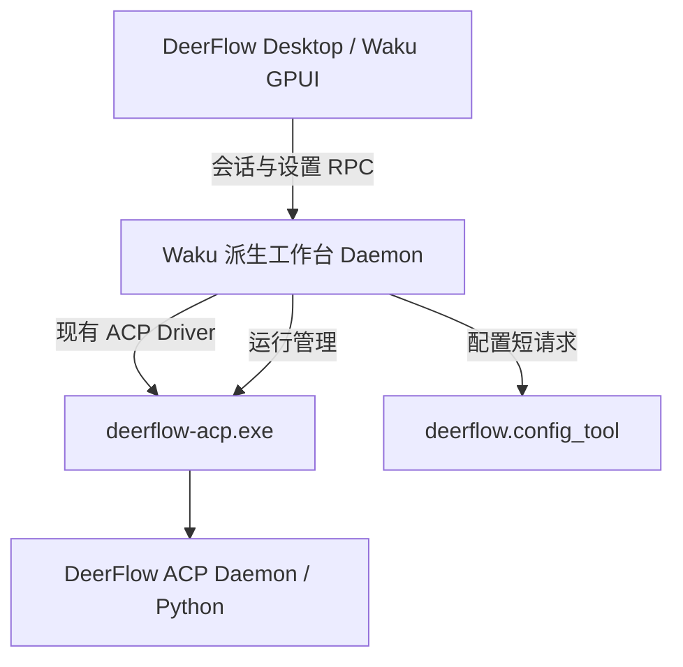

# 直接使用 Waku 代码构建 DeerFlow Desktop

日期：2026-09-17。基于本地 `D:\Tools\waku` 与当前 DeerFlow 仓库的静态源码分析；未构建、启动或联调产品。

## 判断

可行。用户希望保留 Waku 的会话体验时，直接 fork Waku 比在现有 Iced 工具里重新实现同等范围的聊天工作台更值得优先考虑。推荐保留 Waku 的 GPUI、会话管理、消息展示和 daemon，将业务设置换成 DeerFlow ACP 配置页面，并完成便携路径及现有 DeerFlow 适配器的补充。

这里的“换设置”包含 GPUI 表单实现、配置服务接线和配置应用后的会话恢复。原 Iced 页面不能直接作为 GPUI 控件嵌入，但配置规则和服务接口可复用。

## 本地 Waku 已有 DeerFlow 接入

| 能力 | 代码证据 |
| --- | --- |
| DeerFlow Provider 与独立 session cursor | `crates/waku-protocol/src/model.rs:26`、`:233` |
| 启动 deerflow-acp，参数为空 | `crates/waku-core/src/driver/acp.rs:108` |
| 标准 ACP v1 初始化与会话建立 | `crates/waku-core/src/driver/acp.rs:523`、`:717` |
| 从 ACP configOptions 发现模型 | `crates/waku-core/src/model_catalog.rs:982` |
| 用 set_config_option 切换模型 | `crates/waku-core/src/driver/acp.rs:1329` |
| 会话列表与历史导入的 DeerFlow 分支 | `crates/waku-core/src/daemon.rs:522`、`:606` |

因此无需重新开发整个 ACP 客户端，也无需重新增加一个 DeerFlow Provider。需要让现有 Provider 默认定位便携包内的 Bridge，并补齐选项和错误处理。上述存在性不等同于已完成与当前便携包的实机兼容验证。

## 建议保留的进程边界



Waku daemon 继续负责工作台会话、可见消息、项目、附件及文件/Git 操作；DeerFlow daemon 负责 Agent 执行、checkpoint、记忆和 Skills。两层职责不同，初期保留它们最有利于复用 Waku。把 Waku daemon 删除、让 UI 直接接 DeerFlow 会扩大改造范围。

## 设置页迁移

Waku 页面枚举在 `src/app.rs:214`，导航在 `src/app/settings.rs:22`，内容分发在 `:368`。可替换/扩展为 DeerFlow 的概览、模型、智能体、长期记忆、技能、工具权限、ACP、诊断、数据恢复。

- 保留一页“桌面偏好”，承接 Waku 主题、语言、字号、数学渲染等设置；窗口、面板和当前会话状态继续由 Waku 保存。
- 单一 DeerFlow 产品可隐藏其他 Agent CLI 的 Providers 页面，固定使用内置 DeerFlow。先保留其他 driver 源码，可减少初期对 Waku 核心的改动。
- Skills 页面改用 DeerFlow 的技能目录和自进化服务。原 Waku Skills/Usage 与 DeerFlow 数据源不同，需分别适配。
- GPUI 页读取并编辑 DeerFlow `SaveDocument`，通过 `deerflow.config_tool` 的 `snapshot/save/validate/inspect/restore/test-model` 调用现有配置逻辑。
- 不把 DeerFlow 配置塞入 Waku `DaemonSettings.extra`，也不另写 YAML 保存实现。`config_tool.py:766` 已提供锁、revision 检查、脱敏值恢复、校验和备份。
- 推荐在 Waku daemon 增加有类型的 DeerFlow 配置/管理请求，后台执行内嵌 Python 和 Bridge。仅本地原型也可先由 GPUI 后台执行器调用同一包装层。
- “保存并应用”保留 DeerFlow 的 drain、等待任务结束、重启流程；随后刷新模型与 Agent 数据并恢复 ACP 连接。不能用重启 Waku daemon 代替。

最快验证方式是让 Waku 菜单启动现有 `deerflow-config.exe`；这可保留原界面，但会打开独立窗口。正式一体化界面建议重做 GPUI 表单，复用服务及数据结构。

## 需要一并修正的具体问题

1. **计划模式被覆盖。** `driver/acp.rs:788` 的通用逻辑发现当前模式为 plan 时，会尝试改为 default/agent。DeerFlow 分支应尊重后端默认值或显式会话选择。
2. **配置选项不完整。** 模型切换已有；`thinking_enabled` 虽有 ID 映射，但模型目录未提供完整 on/off 控件，选项请求的一些错误被忽略。`agent_profile`、`subagent_enabled`、`tool_approval` 等需要对应控件和响应处理。
3. **恢复失败后自动新建。** `driver/acp.rs:717` 的恢复流程在 resume/load 失败后调用 new。DeerFlow 集成应明确显示恢复失败，让用户选择如何处理，避免工作台仍显示旧聊天但模型已使用新上下文。
4. **两层历史的一致性。** Waku 保存可见聊天，DeerFlow 保存 ACP 会话与模型 checkpoint。需维护 provider cursor 映射；DeerFlow 默认 30 天闲置清理会影响 Waku 中仍保留的旧会话，必须协调保留策略。
5. **fork/rewind 目前是占位。** Waku 的 DeerFlow fork 分支忽略原会话及轮数，返回空 session ID（`daemon.rs:1778`）；历史注入逻辑仅适用于 Cursor，DeerFlow 实际会新建空上下文。首版应隐藏这些操作，或先实现 checkpoint 复制/回退。
6. **退出程序与临时断连不同。** Waku daemon 持有 ACP driver，前端取消订阅并不直接关闭 ACP。但本地默认 daemon 受桌面父进程管理（`waku-client/src/process.rs:162`、`:253`）；真正退出桌面会停止它。若要退出后继续运行，可基于外部独立 daemon 模式扩展生命周期。
7. **图片、产物和计划展示需继续适配。** 当前 ACP prompt 仅构造文本块（`driver/acp.rs:1402`），模型输出主要读取 `content/text`，计划只生成活动提示（`:1919`）。Waku 有附件和文件界面，不代表已完整对接 DeerFlow 的图片块、资源链接和计划条目。
8. **模型冷启动发现需要反馈与重试。** 模型探测只有 10 秒超时，失败返回空列表（`model_catalog.rs:18`、`:982`），首次 Python 启动应纳入验证；临时探测会话也需要清理。

## 便携交付

Waku 已支持 Windows ZIP（`scripts/bundle-windows.ts:130`），但默认数据仍位于 `%LOCALAPPDATA%\Waku` 和 `~/.waku`。需要统一可覆盖的便携数据根，覆盖 app/session 数据、blobs、客户端/daemon 配置、默认任务目录、缓存和更新偏好，避免读写用户原有 Waku 数据。

建议目录职责如下，名称为方案示意：

```text
DeerFlow/
  deerflow-desktop.exe           # Waku 派生 GPUI 程序
  deerflow-desktop-daemon.exe    # Waku 派生工作台后端
  deerflow-acp.exe
  runtime/python.exe
  resources/
  user-data/
    desktop/                    # 工作台会话、blobs、偏好、缓存
    config/                     # 原 DeerFlow 配置
    data/                       # 原 DeerFlow 数据和 checkpoint
    runtime/acp/
    skills/
    backups/
```

Bridge 路径应从便携根动态解析，目录移动后无需修正旧的绝对路径。应用名称、ID、图标及 Windows 资源需要统一。Waku 上游更新地址与签名密钥应关闭或替换为本产品入口（`src/updater.rs:993`）；不要让派生版更新回官方 Waku。上游 Windows 打包脚本还包括 Computer Use helper/SDK 与安装器，首版 ZIP 需按实际功能裁剪打包步骤。

Waku 是 GPL-3.0-only，派生桌面发布需遵守该许可，包括对应源代码等义务。DeerFlow 独立 ACP 进程的原有许可声明应保留，不能将复制后的 Waku 部分仍标为 MIT。

## 推荐实施顺序

1. 在独立的 Waku 派生项目中固定现有源码基线，用当前便携 Bridge 验证新建、恢复、模型选择、审批、取消、图片及产物；先修正计划模式和恢复错误处理。
2. 把现有配置服务接入 Waku 后台，按 DeerFlow 配置工具的信息结构实现 GPUI 设置页，验证草稿保护、密钥保留、并发保存和应用重连。
3. 统一便携数据根、默认 Provider 路径和产品身份，协调历史保留，产出 Windows ZIP 并验证目录迁移。
4. 再增强 DeerFlow 会话选项、产物预览、结构化追问及后台运行；按需要逐步精简其他 Provider。

推荐采用这条路线的前提是希望保留 Waku 的成熟会话工作台，并接受维护 GPUI/Waku 派生代码与 GPL 分发。若目标只是在原 Iced 工具增加轻量聊天窗口，仍可选择前一份分析中的 Iced 路线。
