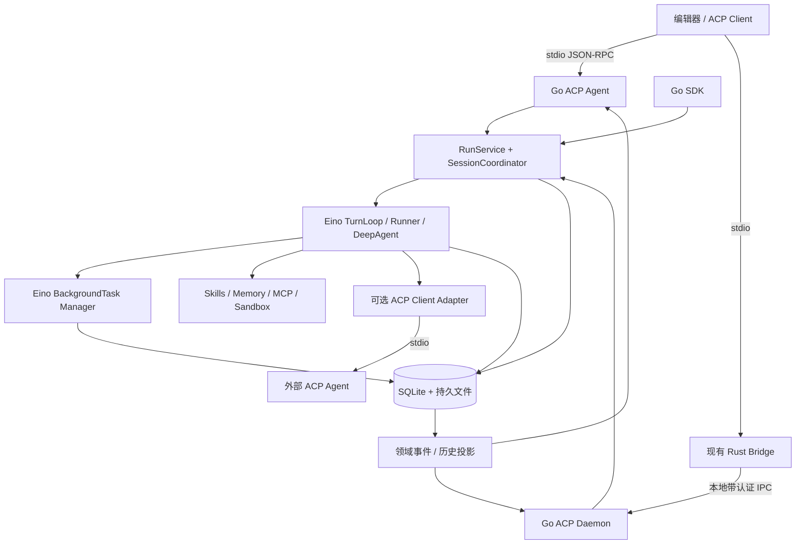

# Go + Eino Harness 与 ACP 重构实施方案

修订日期：2026-09-29。状态：实施中；进度、依赖落地差异与验证记录见 [实施状态](eino-harness-implementation-status.md)。下文保留完整 V1 目标和发布要求。

**第一版交付可嵌入的 Go harness，以及能够被编辑器和其他 ACP client 启动的本地 ACP Agent。** 保留长任务、工具、子 Agent、沙箱、Skills、MCP、记忆、上下文压缩、权限与恢复能力。对外入口采用 Go SDK、ACP stdio 和本地 daemon IPC；HTTP API、ACP HTTP gateway、SSE 服务及远程传输接口后置。模型请求和 MCP 的出站 HTTP 传输仍属于正常工具能力。

## 1. 重构分支与迁移方式

| 项目 | 决定 |
| --- | --- |
| 重构分支 | `codex/eino-harness-acp-refactor` |
| 基线 | 当前仓库 main 已提交版本 `92b56924989a91e0eae05be6e95a6304f1ee4cd4` |
| 隔离工作区 | `C:\Users\ym200\.codex\worktrees\eino-harness-acp\deerflow-api` |
| 新代码位置 | 同仓库 `go-harness/`，独立 `go.mod` |
| 迁移方法 | 先增加 Go 实现并做协议对照，再切换 ACP 启动命令；Python 作为回归参照与回退入口 |
| 提交粒度 | 方案、协议基线、存储、执行核心、ACP、工具与扩展、故障验证分别提交 |

原工作目录存在尚未提交的 ACP 启动优化及其他修改，没有自动复制到新工作区。阶段 0 建立迁移清单，检查这些变动是否已提交或需要有选择地纳入；不能通过覆盖原目录或批量暂存把无关改动带入重构提交。

Python `deerflow/acp/`、现有测试和 `bridge/` 是当前产品协议基线；字节官方 harness 用于补齐能力设计。第一版先实现新会话在 Go 端的完整闭环，旧 LangGraph 执行快照不直接导入 Go。

新旧实现使用不同的数据目录、数据库与 daemon endpoint。只有完成迁移验收后才切换默认启动目标，避免 Python 和 Go 进程同时写同一套状态。

## 2. 版本与技术选择

采用截至评估日最新已发布的 Eino 预发布版 **`v0.10.0-alpha.35`**，commit `3f5ec670e75daeabf14aee741990ebb02f28cefb`。其 session、backgroundtask、TurnLoop、automemory 已能承担许多运行机制。稳定版 `v0.9.21` 与 alpha 分支有分叉，不能假定 alpha 包含稳定版的全部补丁。

| 依赖 | 拟固定版本/方案 | 说明 |
| --- | --- | --- |
| Go | 模块 1.26.0，工具链 1.26.8 | 实施时已固定；SQLite v1.60.0 要求 Go 1.26，覆盖 MCP/文件扩展要求 |
| Eino | `v0.10.0-alpha.35` | 核心执行和会话运行机制 |
| eino-ext openai | `v0.1.13` | OpenAI-compatible 模型 |
| eino-ext claude | `v0.1.25` | 避开 v0.1.26 的字段不兼容 |
| eino-ext ark | `v0.1.71` | 火山方舟 |
| eino-ext officialmcp | `v0.1.1` | 官方 MCP Go SDK 的适配模块 |
| ACP Go transport/SDK | 固定 `github.com/coder/acp-go-sdk v0.13.5` 的协议类型 | 独立有界 stdio 双向 JSON-RPC；同步准入，避免 SDK 默认 prompt 自动抢占 |
| ACP 规范 | 官方 stable `protocolVersion = 1`，固定 schema 快照 | 不把项目已有 draft v2 facade 当成稳定协议 |
| 默认持久化 | SQLite，WAL + 单 daemon 所有权 | 本地启动无需 PostgreSQL；预留 store 接口 |
| 沙箱/工作区 | 受控本地文件 backend + 可选 Docker/WSL2 backend | 兼顾当前 ACP cwd 行为和真正隔离的执行能力 |

Eino、三个模型扩展、SQLite、ACP SDK 类型及 MCP 扩展已完成组合编译，版本固定在 `go-harness/go.mod/go.sum`。MCP 官方 SDK 固定为 `v1.6.1`。阶段 0 的流式、checkpoint、ACP 双向调用与后续互操作记录见实施状态。禁止所有模块统一浮动 `@latest`。

已确认最新部分模型扩展使用 `CacheWriteTokens`，Eino alpha.35 暂无该字段。V1 先采用 `*schema.Message`，新的原生 AgenticMessage 接口经 engine adapter 后续加入。

ACP 官方目前列出的是社区 Go SDK。`coder/acp-go-sdk` 和 `eino-contrib/acp` 的类型均可能落后最新规范；后者还包含此版不需要的 WebSocket/HTTP 依赖。因此优先验证前者，将 schema 差异集中在 `internal/acp/protocol`；如果缺少注册新方法的接口，使用最小范围的本地补丁或生成类型，并保留许可证和上游修订信息。

## 3. 现有 ACP 契约与第一版目标

本项目已具有 Python ACP v1 Agent、常驻 daemon、多连接会话隔离、权限请求、媒体与产物、Rust draft v2 facade。此次接入应迁移这些行为，不从简单聊天 demo 起步。

| 能力 | 当前实现事实 | Go V1 目标 |
| --- | --- | --- |
| initialize | v1 握手；能力随视觉模型、MCP 开关变化 | 按真实支持声明 capability，保留客户端能力用于后续调用 |
| session | new/load/list/close，cwd 约束和分页 | 同等行为，元数据和会话配置持久化 |
| 模式和选项 | default/plan；model、thinking、profile、subagent、approval | 通过 mode/config options 接口切换；运行中拒绝冲突修改 |
| prompt/cancel | 每会话一个活动 prompt；取消后等待流关闭和保存 | 保留调用生命周期和忙碌边界；队列等待与执行超时分开 |
| 权限 | 主/子 Agent request_permission；once/always；失联拒绝 | 审批精确绑定 connection/session/toolCall/参数版本 |
| 输入 | text、image、本地 resource_link；视觉按当前模型校验 | 保留媒体校验、附件持久化和路径隔离 |
| 输出 | 文本/可展示推理、计划、工具、子任务、usage、产物 | 统一内部事件后映射 ACP updates，保持工具 ID 稳定 |
| client MCP | 默认关闭，受信配置后按 session 绑定 | stdio 配置支持为必做；启动受权限/允许列表控制，HTTP/SSE 按 capability 开启 |
| stdio/daemon | 直接 stdio；Rust Bridge 经 loopback 连接 daemon | Go stdio 为直接入口；Go daemon 兼容本地 Bridge IPC |
| 外部 ACP Agent | 通用 harness 有调用工具，但本地 ACP 策略禁用 | V1 后段提供可选 ACP client adapter，默认不暴露，显式授权后启用 |
| draft v2 | Rust facade 提供 ACK/状态更新、resume/load 映射 | 复用现有 Bridge 作兼容层，独立测试与 stable v1 区分 |

当前 Python v1 的 authenticate、set_model、fork、resume 是明确的 method-not-found stub，不能据方法名宣称已经支持。模型选择继续优先 config options。最新 stable schema 中部分 session 能力已转正：阶段 0 对照 schema，V1 在 SDK 与客户端验证通过后增加 `session/resume`；`session/load` 历史重放必须交付。fork 不作为首版必须能力。

Rust v2 facade 当前没有完整 mode/config handler；其 prompt 立即 ACK，之后发 running/idle；v1 prompt 则在回合结束后返回。这两种行为必须分开测试。

## 4. Harness 功能范围

| 能力 | 第一版交付 | 主要实现 |
| --- | --- | --- |
| Agent 核心 | 多轮推理、工具循环、流式、模型路由、retry/fallback | Eino DeepAgent、Runner、handlers |
| 规划和连续性 | todo、目标、委派记录、技能引用、产物引用 | Eino todo/plantask + TaskContext |
| 子 Agent | 隔离上下文、并行上限、前后台、进度、取消、HITL、恢复 | alpha backgroundtask/subagent |
| 工具 | schema、注册/分组、动态发现、timeout、错误、结果与回执 | Eino tool/toolsearch + ToolRegistry |
| 工作区和沙箱 | 文件读写/搜索、附件、命令、后台输出、资源控制 | Backend/Shell adapter + SandboxProvider |
| Skills | 渐进加载、安装校验/扫描、版本、启停、只读投影与范围 | Eino skill + SkillRegistry |
| MCP | stdio/SSE/HTTP 出站、连接管理、动态工具与凭据 | officialmcp + scoped manager |
| 记忆 | workspace/session/global 范围、提取/注入、查看/删除、flush | automemory + scoped backend |
| 上下文 | 工具输出落文件、清理与摘要、token/时间/轮次预算 | reduction/summarization + policy |
| 人工交互 | 工具授权、澄清等待、取消、恢复 | ACP adapter + Eino interrupt |
| 持久状态 | 输入、session events、checkpoint、后台任务、历史/回滚 | SQLite Eino providers |
| ACP 运行 | 多窗口、会话所有权、配置、媒体、事件映射、daemon | ACP adapter + LocalHost |
| 观测 | 结构化日志、用量、trace hooks、审计、启动诊断 | callbacks + 本地日志/诊断命令 |

默认内部委派深度为 1，权限和预算继承父运行。外部 ACP 委派也受同一总预算和取消链控制；不能通过调用外部 Agent 绕过本地 ACP 默认策略。

HTTP 服务、SSE、跨主机 worker、PostgreSQL、任意工具步 time travel、旧 Python 插件原样加载、多云沙箱全覆盖、完整 TUI、自动技能进化后置。现有 skill proposal 私有管理接口如需保留，独立列兼容工作包；它不属于标准 ACP。

## 5. 架构与代码组织



Eino 负责执行循环、后台任务状态机和 session 重建。RunService 管理业务运行、输入、预算和恢复；SessionCoordinator 管理连接附着、会话互斥、取消与清理；ACP adapter 管理协议与反向请求。三者不依赖 HTTP。

公共 Go SDK 使用自己的 AgentSpec、RunRequest、Message、RunEvent、ToolSpec 和错误类型。Eino alpha 类型封装在 engine adapter；ACP schema 类型封装在 protocol adapter，避免两侧版本变化传播到业务层。

```text
go-harness/
  go.mod / go.sum
  harness/                    公共 SDK 与领域类型
  cmd/deerflow-acp-go/         标准 ACP stdio 入口
  cmd/deerflow-acpd-go/        本地常驻 daemon
  internal/engine/eino/        Agent 装配、Runner/TurnLoop、事件转换
  internal/runtime/            RunService、输入队列、恢复、预算
  internal/acp/protocol/       SDK/schema 适配和稳定协议边界
  internal/acp/agent/          initialize/session/prompt/cancel
  internal/acp/client/         外部 ACP Agent 委派
  internal/acp/events/         领域事件到 ACP update
  internal/acp/permissions/    反向审批请求与连接路由
  internal/localhost/          daemon、IPC、endpoint、进程锁
  internal/session/            attachment、cwd、配置、历史、清理
  internal/storage/sqlite/     Eino stores 与业务表
  internal/{tools,policy,agents,skills,memory,mcp,sandbox,artifacts}/
  internal/observability/
  contracts/acp/ fixtures/ migrations/ examples/ tests/
```

## 6. ACP 协议设计

**传输。** 标准入口采用双向 JSON-RPC 2.0 的 UTF-8 换行分隔消息。stdout 仅输出协议消息，日志写 stderr；daemon 日志写独立文件。读写循环分离，prompt 执行期间仍能接收 cancel 和 permission response。帧大小有上限，并保留当前大图片输入所需的可配置 64 MiB 上限测试。

**会话。** ACP sessionId 映射持久 thread_id/主 Eino session；run_id 和 Eino turn_id 另外记录。连接 ID 仅用于当前 transport 的路由，不作为持久身份。new/load 校验绝对 cwd、真实目录及符号链接/junction；load 不允许悄悄更换 workspace。session/load 必须发送完整 conversation updates 后再响应；session/resume 只恢复上下文，不重放历史。close 关闭和释放资源，不等于删除历史。

**prompt 生命周期。** stable v1 的 session/prompt 在回合终止后返回 stopReason；流式内容通过 session/update 发送。session/cancel 是通知，没有独立成功响应；取消完成后原 prompt 返回 cancelled，不能把 context.Canceled 当成内部错误。终止前关闭未完成工具卡、保存状态并排空有界输出队列，然后释放 session busy 状态。标准 stopReason 为 end_turn/max_tokens/max_turn_requests/refusal/cancelled；tool status 为 pending/in_progress/completed/failed，不能发送自造的 cancelled tool status。coder SDK 对同 session 新 prompt 有取消旧 context 的行为，互斥检查必须位于触发该行为之前，不能只在业务 handler 内加锁。

**权限和澄清。** 工具执行前先持久化审批意图，再向所属连接发送 session/request_permission。验证所选 optionId；allow/reject once/always 作用域不扩大到其他 session。参数或策略版本变化使旧批准失效。ACP 标准 permission outcome 不包含“修改工具参数”，参数修改若需要，作为显式后续输入或协商扩展处理。通用澄清通过助手提问和后续 prompt 完成，映射到内部等待状态；不把 permission 接口伪装为任意表单。

**重新连接。** JSON-RPC request ID 不跨连接恢复。重新 load/resume 后按持久审批意图重新发出必要请求，不能等待旧连接的 response。标准 ACP 不提供 SSE Last-Event-ID；V1 通过 load 重放历史，resume 仅恢复上下文，不承诺 token 级精确游标重放。

**能力协商。** 只声明通过测试的 image、load/list/close/resume、MCP 等能力；只有 clientCapabilities 声明支持时，才可调用客户端 fs/terminal。V1 默认保持当前直接访问受控本地工作区的模式。客户端 filesystem/terminal adapter 可在 V1 后段增加，但它们是客户端能力，不等价于 Agent 自带 sandbox，也不作为基础互操作前置条件。client 模式可读取 IDE 未保存缓冲区，本地磁盘模式不能声称有相同语义，禁止暗中切换。客户端 terminal 的 create/output/wait_for_exit/kill/release 生命周期独立管理，不能与容器进程 ID 混用。

**客户端 MCP。** 当前 stable ACP 要求支持 session 请求中的 stdio MCP 配置，没有关闭 stdio 的 capability 位。V1 实现 name/绝对 command/args/env 的解析与运行，允许列表和审批约束实际进程启动；策略拒绝时返回明确错误。不能把旧版本“完全不支持 client MCP”的受限 profile 描述为完整支持此协议能力。HTTP/SSE 是可选 MCP capability，默认由配置决定。env/headers 作为凭据处理，不进入模型上下文、公开事件或普通日志。

**Harness 专有操作。** 暂停、回滚、后台任务管理没有可直接套用的通用 stable ACP RPC。SDK/本地控制通道可提供这些操作；若客户端需要协议入口，只通过协商过的 `_deerflow/...` 扩展暴露，并明确其自定义性质。子 Agent 进度先映射为可追踪 tool_call/update，无须为每个子 Agent 创建一个对外 ACP session。

实施中已确定前台执行与后台任务分开管理。前台使用 `_deerflow/executions/*`，后台使用 `_deerflow/tasks/*` 与 `_deerflow/notifications/*`；均按真实宿主能力协商。标准 `session/resume` 只重新附着会话。后台审批需要先查询固定批次中工具的实际参数，再提交一次性决定；关机保存的 `suspended` 任务通过带版本校验的显式恢复入口继续。原生 checkpoint 和 resume target 不允许由客户端传入。后台提交沿用父 run 的预算，并只复制显式文本指令；V1 当前阶段不向后台复制 ACP client 所有的 MCP 连接或父会话附件能力。

后台结果进入父模型采用独立持久 continuation。SDK `ProcessBackgroundNotification` 和协商扩展 `_deerflow/notifications/process` 只接收已保存通知 ID，以新 run/input 绑定原预算和来源快照；UI 已读、native outbox ACK 与模型投递分别记录。重复 process 返回原 execution，待批工具通过已有 executions 恢复；来源、配置或扩展版本冲突时保留通知并拒绝执行。初期使用显式处理，自动调度后续复用同一准入逻辑，详见 [通知设计](eino-notification-continuation-design.md)。

**媒体与产物。** 支持文本、图片和本地 resource_link；逐会话检查模型视觉能力。图片经大小/数量/MIME 校验后持久化，checkpoint 保存引用。输出使用 ACP 标准内容/资源块及工具结果；本地文件链接可供同机客户端使用，不能假定不同机器能读取宿主路径。远程产物托管和自动下载不属于当前无 HTTP 服务的交付范围。

**外部 ACP Agent。** 可选 client adapter 执行 initialize → new/load → prompt，转发工具/进度/产物和权限，并传播取消。仅启动配置白名单中的程序，使用独立 workspace，禁止默认 auto-approve。把外部 Agent 请求的 fs/terminal/permission 映射到自身策略；没有实现的 client capability 不声明。默认本地 ACP profile 保持禁用外部委派，需要显式配置启用。

## 7. 本地 daemon 与存储

第一版采用一个 daemon 管理多连接、多 session，SQLite 单写者所有权与进程锁保护数据库。每个 session 同时只附着一个控制连接，每 session 最多一个 active prompt。连接数量上限与模型执行槽位分开，排队时间不计入执行超时。

兼容现有 Rust Bridge 的 `DFACP/1` loopback token handshake、endpoint 发现、STATUS/STOP/ACP 命令和启动参数。这个通道是本机 IPC，不是对外网络 API。MANAGE 单列为本地产品控制协议，不能混入 ACP method namespace；首版只迁移运行所需的诊断/配置操作，skill evolution proposal 操作按后置范围明确报告不支持。

Go stdio 进程退出和 daemon 客户端断开遵循不同进程生命周期，但会话隔离语义一致：断开只取消/保存该连接关联的前台运行，停止待批工具，释放临时 client MCP 和 attachment，不影响其他窗口。默认暂停与该连接绑定的子任务；只有显式配置为可脱离前台的任务才继续运行，且不能在无人连接时自动获得新的授权。结果存入任务记录，待重新附着或下一次 prompt 呈现。

SQLite 实现 CheckPointStore、SessionEventStore、backgroundtask TaskStore/TaskEventStore/NotificationOutbox；使用事务、唯一约束、版本 CAS 和租约验证满足 Eino 契约。优先选择可跨平台构建的 driver，具体版本在阶段 0 固定。PostgreSQL 的跨进程调度方案后置，V1 不用分布式假设增加本地复杂度。

业务数据包含 sessions、connections/attachments（运行态）、runs、run_inputs、tool_receipts、approvals、artifacts、agent_versions。引擎数据包含 session_events、checkpoints、background_tasks、task_events、task_notifications。

输入先落库，再 Push TurnLoop；只有相关 session 事件提交才确认消费，用 input_id 关联避免重复输入。Eino session/checkpoint/task store 调用不天然属于同一个数据库事务，保留原生写入顺序和错误语义，运行状态通过幂等投影/恢复扫描对账。

事件消费由运行时负责，不能由 stdio 写入速度决定模型是否继续执行。持久语义事件与 ACP 发送队列分开；队列有界，文本可合并，工具/权限/终态不能丢弃。连接丢失执行既定取消策略；重连通过 session 历史恢复，不虚构网络 exactly-once。

## 8. 恢复、工作区与策略边界

alpha.35 的 session 历史/回滚可直接复用；TurnLoop checkpoint 主要在显式停止、可保存的取消和业务中断时产生，仍不保证任意指令点崩溃后原位继续。

| 情况 | V1 行为 |
| --- | --- |
| 审批/暂停/优雅关闭 | 持久化意图和 checkpoint；重新连接后按规范继续交互 |
| 有有效 checkpoint 的恢复 | 固定配置/工具版本后 Resume |
| 无有效 checkpoint 的突然退出 | 核对已提交 session、输入和工具回执，建立新的恢复 attempt |
| 外部写操作结果不明 | needs_reconciliation；查询结果或人工处理，禁止盲重放 |
| 历史回滚 | 无活跃运行/关联任务时回到 committed idle 边界；不撤销文件与外部副作用 |

工具回执记录逻辑调用、参数摘要、幂等键、attempt、产物与最终状态。MCP 重连后的自动重试需区分只读与有副作用工具；本地 receipt 不能保证远程 exactly-once。长命令需要 task-ID 可查询的执行 backend 才能恢复；仅持有进程句柄的 backend 必须标为 process-local。

ACP workspace 模式默认沿用当前 cwd 边界。本地文件工具在执行边界校验路径/链接/读写权限；本地 Shell 默认关闭，启用后仍需要策略与权限，并明确不是 OS 隔离。Windows 使用原生文件操作及明确选择的 PowerShell/WSL2 执行 adapter；不能直接套用依赖 /bin/sh 的 eino-ext local backend。

Docker provider 作为 V1 的隔离执行选项，实现 Eino Backend/Shell adapter、workspace 挂载、只读 skills、资源/网络限制和进程组取消。工具事件中的路径要从容器路径映射为客户端可理解的 workspace 路径，避免编辑器打开错误文件。

主/子 Agent、摘要和记忆共享预算，调用前预留，返回后结算；缺少 usage 的 provider 标记估算。TaskContext 保存目标、todo、子任务、技能和产物引用，摘要压缩不删除执行证据。记忆默认按规范化 workspace 隔离，并保留 session/global 可配置范围和 shutdown flush。

## 9. 实施顺序与验收

| 阶段 | 内容 | 完成条件 |
| --- | --- | --- |
| 0，3–5 天 | 新分支基线清单；冻结 Eino/ext/ACP schema；提取现有 wire fixtures；SDK 差异清单 | 编译组合、initialize/new/prompt/cancel/permission 往返；确认 load/resume 语义和 schema 支持范围 |
| 1，1–1.5 周 | Go 模块、SDK、SQLite stores、SessionCoordinator、最小 ACP stdio | 真实子进程 stdout 干净；Eino store conformance；new/list/load；重启后历史存在 |
| 2，1.5–2 周 | DeepAgent、工具和事件映射、工作区、图片/附件、权限、预算 | 编辑器中工具进度/计划/产物可见；拒绝/取消正确；路径和配置隔离 |
| 3，1.5–2 周 | 子 Agent/后台命令、Skills、MCP、记忆、压缩、Docker provider | 并发和父子取消；压缩不丢任务上下文；MCP/记忆不串 session；隔离执行完成产物 |
| 4，1–1.5 周 | Go daemon、Bridge IPC、draft v2 兼容、可选外部 ACP client | 两窗口隔离、热启动、STATUS/STOP；v1/v2 生命周期分别通过；外部委派权限不升级 |
| 5，1–1.5 周 | 崩溃对账、重连、清理、负载、便携打包和切换演练 | Windows/Linux 真实 stdio 与 daemon；未决副作用可解释；可切回 Python 启动入口 |

按 2 名熟悉 Go/Agent 的工程师和测试支持，粗估约 **7–10 周**；阶段 0 后校准。删除 HTTP 工作包不会使协议重构变成简单包装，ACP 的反向请求、连接归属和已有 Bridge 兼容仍需要专门投入。

发布必须覆盖以下行为：

1. 真实 stdio initialize/new/prompt/cancel/load，分片读写、JSON-RPC 错误、未知方法和协议版本；日志不污染 stdout。
2. 两连接不同 session 并行，同 session 不双附着；A cancel/disconnect 不影响 B；清理完成前仍 busy。
3. 主/子 Agent 的 permission 路由、once/always、撤销、取消竞态、失联拒绝；重连不复用旧 request ID。
4. cwd 规范化、目录被删除、symlink/junction、越界 file resource、Windows 大小写与盘符。
5. 必需 stdio MCP 配置的正向互操作与策略拒绝、可选 SSE/HTTP capability、凭据隔离、重连与释放失败处理。
6. 文本/图片/附件、视觉 capability 与会话模型一致、资源大小校验、64 MiB 帧、产物/累计文本去重。
7. load 历史重放包含用户/助手/工具/计划/产物；协议不支持的精确游标请求明确拒绝。
8. draft v2 的先 ACK 后 running/idle，与 v1 最后返回 prompt response 分离；已有 Bridge resume 规则不被无意改变。
9. daemon 单实例、错误 token、容量满仍可控制、启动/退出不泄漏 stdio handle、状态文件不被误删。
10. 重启后审批和后台任务恢复、工具结果不明的对账、会话清理不删除活跃任务或仍需保留的产物。

现有 Python 测试转换成协议/行为 fixtures，不按内部 LangGraph 调用结构逐行复制；旧行为与最新规范冲突时单列迁移差异。引入官方 acp-tck 验证 stable v1，并补它未完整覆盖的 MCP/fs/terminal 和真实编辑器互操作。复用 Eino 的 session/backgroundtask/tool recovery conformance，增加 SQLite 事务/锁、Go race、实际子进程与 Bridge 集成测试。

## 10. 参考与协议基线

- [Eino alpha.35](https://github.com/cloudwego/eino/releases/tag/v0.10.0-alpha.35)、[session](https://github.com/cloudwego/eino/blob/v0.10.0-alpha.35/adk/session.go)、[backgroundtask store](https://github.com/cloudwego/eino/blob/v0.10.0-alpha.35/adk/backgroundtask/store.go)、[TurnLoop checkpoint](https://github.com/cloudwego/eino/blob/v0.10.0-alpha.35/adk/turn_loop_checkpoint.go)。
- [eino-examples chatwitheino](https://github.com/cloudwego/eino-examples/tree/a6dbd95ab51fe9896a2bafa2e5a468e3bed01161/quickstart/chatwitheino)、[DeepAgent/HITL 示例](https://github.com/cloudwego/eino-examples/blob/a6dbd95ab51fe9896a2bafa2e5a468e3bed01161/adk/human-in-the-loop/7_deep-agents/main.go)。
- [eino-ext 固定参考](https://github.com/cloudwego/eino-ext/tree/3603a39473c3e7b2aa3bfc11216487c94b8c7fd9)、[officialmcp session](https://github.com/cloudwego/eino-ext/blob/3603a39473c3e7b2aa3bfc11216487c94b8c7fd9/components/tool/mcp/officialmcp/session/session.go)。
- [ACP 官方规范仓库](https://github.com/agentclientprotocol/agent-client-protocol/tree/2c9c4aade722b0d2bfaaa6c8c97cd2520e379683)、[社区 Go SDK v0.13.5](https://github.com/coder/acp-go-sdk/tree/v0.13.5)、[eino-contrib/acp](https://github.com/eino-contrib/acp)。
- [ACP v1 session 规范](https://agentclientprotocol.com/protocol/v1/session-setup)、[prompt/cancel 规范](https://agentclientprotocol.com/protocol/v1/prompt-turn)、[官方 acp-tck](https://github.com/agentclientprotocol/acp-tck)。
- 本仓库 `deerflow/acp/agent.py`、`event_mapper.py`、`permission.py`、`session_coordinator.py`、`daemon.py`、`client_mcp.py`、`workspace.py`，以及 `bridge/src/v2.rs`。
- 本仓库 `tests/test_local_acp_agent.py`、`test_local_acp_stdio.py`、`test_local_acp_daemon.py`、`test_local_acp_bridge.py`、`test_local_acp_workspace.py`、`test_local_acp_v2_media.py`、`test_acp_artifacts.py`、`test_invoke_acp_agent_tool.py`。

设计基线来自源码与现有测试内容的核对；实施后的组合编译、协议测试与尚未通过的发布门槛持续记录在 [实施状态](eino-harness-implementation-status.md)，以锁定依赖和可重复测试为准。
